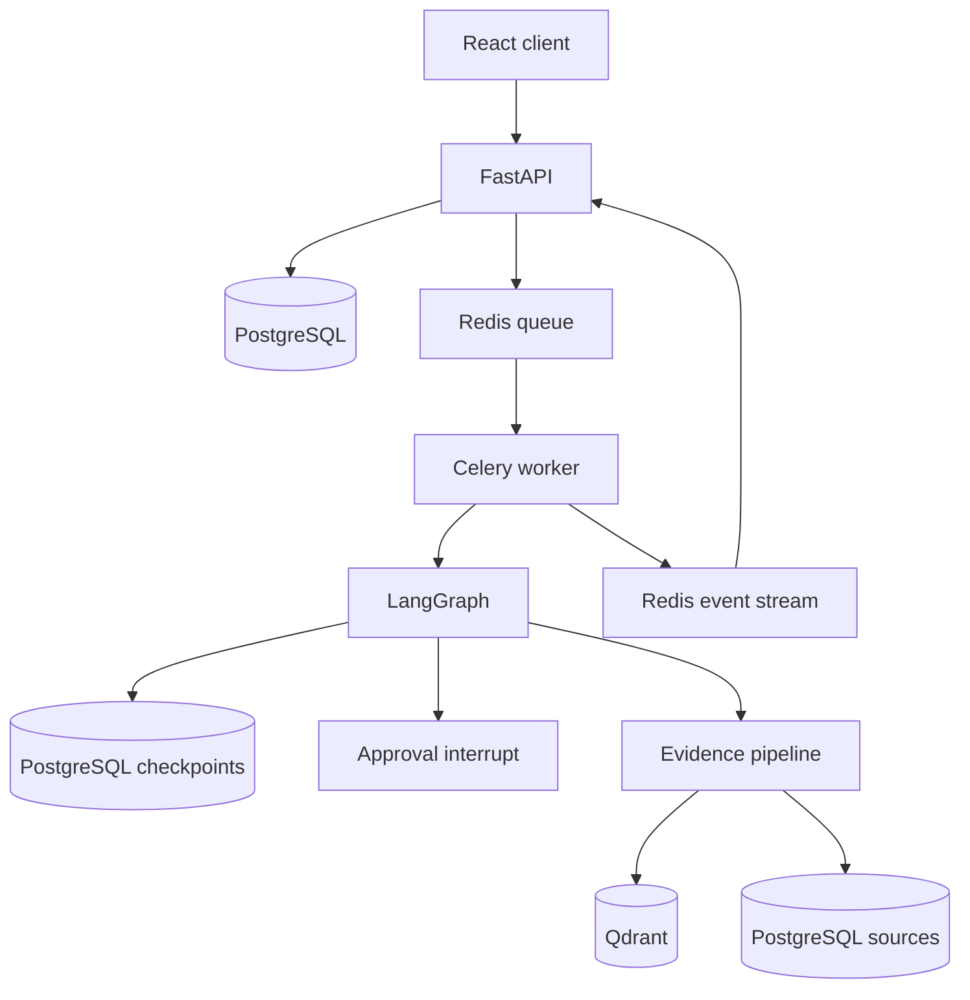

# Enterprise Deep Research Agent

A production-oriented autonomous research system built with LangGraph, FastAPI,
PostgreSQL, Redis, Qdrant, Celery, and React.

This first milestone proves the hardest foundation before paid search and LLM calls:

- durable research-run records in PostgreSQL;
- LangGraph checkpoint persistence in PostgreSQL;
- human approval interrupts and resume commands;
- Celery workers with Redis-backed jobs and bounded retries;
- Redis Streams events exposed as server-sent events;
- deterministic mock planning, research, and synthesis nodes;
- Qdrant infrastructure for searchable evidence;
- Alembic migrations and orchestration tests.

> The current report content is intentionally mock data. It validates orchestration and
> must not be treated as real research.

## Architecture



## Requirements

- Docker Desktop with Compose, or Docker Engine with Compose v2
- Optional for host development: Python 3.11 or 3.12

## Start locally

```bash
cp .env.example .env
docker compose up -d postgres redis qdrant
docker compose run --rm api alembic -c backend/alembic.ini upgrade head
docker compose up --build api worker
```

Open:

- API documentation: <http://localhost:8000/docs>
- Health check: <http://localhost:8000/v1/health>
- Qdrant: <http://localhost:6333/dashboard>

## Test the research flow

### 1. Create a run

```bash
curl -X POST http://localhost:8000/v1/research/runs \
  -H "Content-Type: application/json" \
  -d '{"query":"Analyze the Indian EV market and compare major companies","budget_usd":2}'
```

Keep the returned `id`. The worker will plan the research and pause at the approval
checkpoint.

### 2. Inspect the run and plan

```bash
curl http://localhost:8000/v1/research/runs/RUN_ID
curl http://localhost:8000/v1/research/runs/RUN_ID/approval
```

### 3. Approve and resume

```bash
curl -X POST http://localhost:8000/v1/research/runs/RUN_ID/approval \
  -H "Content-Type: application/json" \
  -d '{"decision":"approved","note":"Proceed with this scope"}'
```

The same LangGraph thread resumes from its PostgreSQL checkpoint and creates a mock
report. Poll the run endpoint or consume the SSE stream:

```bash
curl -N http://localhost:8000/v1/research/runs/RUN_ID/events
```

### 4. Run automated tests

```bash
python -m venv .venv
source .venv/bin/activate
pip install -e '.[dev]'
pytest
ruff check backend
```

On Windows PowerShell, activate with `.venv\Scripts\Activate.ps1`.

## Current API

| Method | Endpoint | Purpose |
|---|---|---|
| `GET` | `/v1/health` | PostgreSQL and Redis health |
| `POST` | `/v1/research/runs` | Create and queue a research run |
| `GET` | `/v1/research/runs/{id}` | Inspect status, plan, result, or error |
| `GET` | `/v1/research/runs/{id}/approval` | Inspect approval request |
| `POST` | `/v1/research/runs/{id}/approval` | Approve/reject and resume the graph |
| `GET` | `/v1/research/runs/{id}/events` | Stream run events over SSE |
| `GET` | `/v1/research/runs/{id}/sources` | List discovered and scored sources |
| `GET` | `/v1/research/runs/{id}/evidence` | List extracted evidence passages |
| `GET` | `/v1/research/runs/{id}/usage` | Inspect tool, token, and cost totals |

## Enable live web research

Mock mode remains the default so tests and initial setup use no API credits. To enable
live discovery, edit `.env`:

```dotenv
RESEARCH_MODE=live
SEARCH_PROVIDER=tavily
TAVILY_API_KEY=your_tavily_api_key
```

Restart both application processes after changing configuration:

```bash
docker compose up -d --build api worker
```

Live mode runs the five planned searches concurrently, deduplicates normalized URLs,
validates DNS and every redirect against SSRF rules, extracts readable HTML, scores
source quality, stores evidence in PostgreSQL, and adds sparse evidence vectors to
Qdrant. Failed pages are recorded in `tool_executions` without failing the whole run.

## Upgrade from Milestone 1

After replacing the source files, apply the new database migration:

```bash
docker compose run --rm api alembic -c backend/alembic.ini upgrade head
docker compose up -d --build api worker
```

## Current Milestone 2 capabilities

Milestone 2 adds:

1. search-provider and LLM-provider interfaces;
2. Tavily search plus deterministic mock providers;
3. parallel search and page-fetch fan-out;
4. redirect-aware SSRF protection and bounded downloads;
5. source, evidence, tool-execution, and LLM-call models;
6. content hashing, URL deduplication, and source-quality scoring;
7. sparse Qdrant evidence indexing;
8. token, latency, and cost ledger APIs.

The next milestone implements the critic, coverage matrix, contradiction records, and
bounded follow-up research loops. The mock graph remains available so reliability tests do
not require network access or consume API credits.
